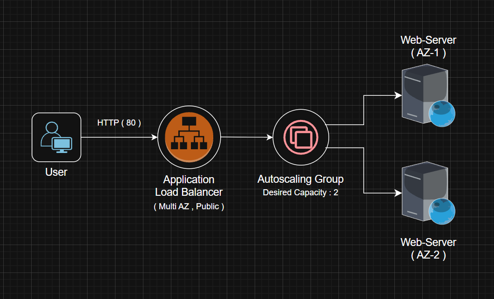
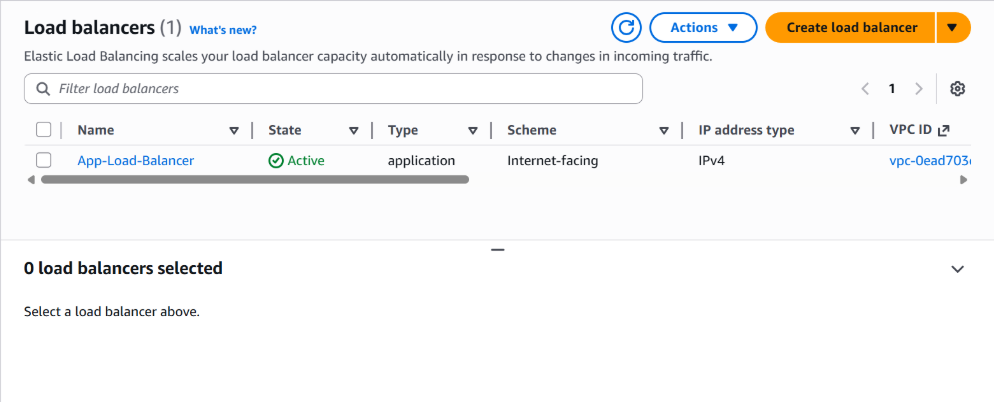
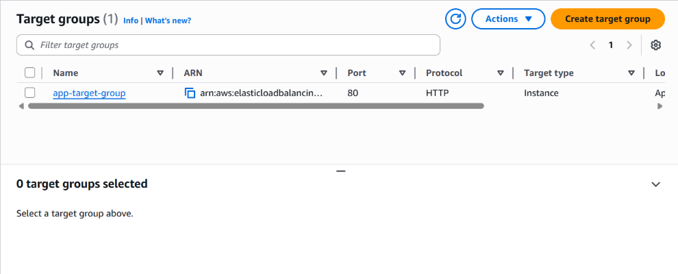
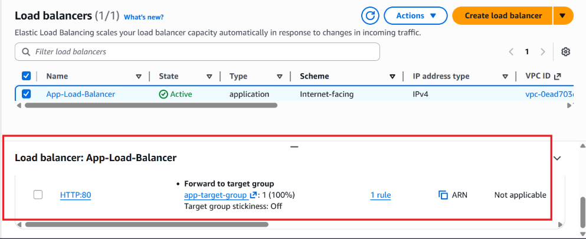

# SelfHealing Infrastructure Using Terraform
This project implements a self-healing cloud infrastructure that automatically maintains application availability and reliability. The system continuously monitors resource health, detects failures, terminates unhealthy EC2 instances, and launches new instances to maintain the desired capacity.

It achieves self-healing behavior using **Auto Scaling Groups**, **health checks**, and **Load Balancer integration**, ensuring high availability, fault tolerance, and resilient infrastructure through automated recovery mechanisms.

## Architecture



## How the System Works..?
1. The user sends an HTTP request to the Application Load Balancer (ALB) DNS endpoint.

2. The ALB intelligently forwards the request to a healthy EC2 instance within the target group.

3. The Auto Scaling Group (ASG) continuously monitors the health status of all EC2 instances using integrated health checks.

4. When an EC2 instance becomes unhealthy:

    ● The instance is automatically terminated

    ● A new EC2 instance is launched to replace it

5. The ALB dynamically updates routing and ensures traffic is sent only to healthy instances, maintaining availability and performance.

## Step 1 :  Write Files

Write the terraform files : 
1. main.tf
2. variable.tf

## Step 2 : Deploy Infrastructure

Execute these commands in terminal :

```
# Step 1: Initialize Terraform
terraform init

# Step 2: Preview infrastructure changes
terraform plan

# Step 3: Deploy infrastructure
terraform apply --auto-approve
```

## Step 3 : Resources created 

### 1. Networking Resources

● VPC – Isolated virtual network

● Public Subnets (2 or more) – Deployed across multiple Availability Zones

● Internet Gateway – Enables internet access for public resources

● Route Table – Routes outbound traffic to the Internet Gateway

### 2. Load-Balancer
Application Load Balancer



### 3. Target Group



### 4. Application LoadBalancer Listner



### 5. Autoscalling Group


## Conclusion

This project showcases a self-healing infrastructure built with Terraform that ensures high availability, automated recovery, and scalable cloud deployments using modern DevOps best practices.
